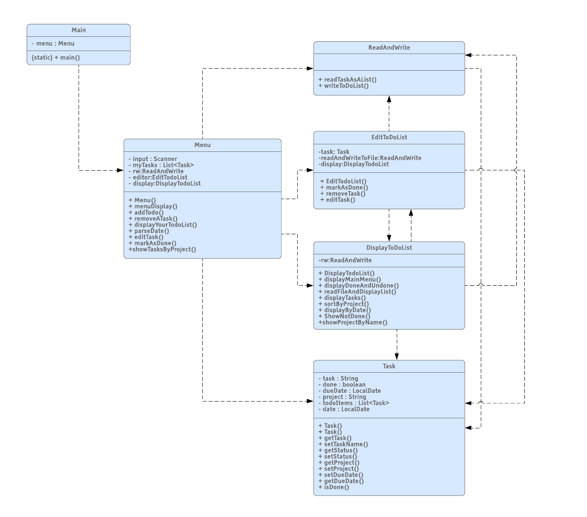

# To-do-App
To-do-App is a java application for storing a todo list of tasks.

#Features!

  - Can add tasks based on given due date
  - Tasks can be  marked as done
  - Tasks can be grouped by Due date or project/sorting
  - Every menu is selected using a number id provided 
  - Text based inteface is provided
  - Show incomplete tasks
  
### Installation
    Java VM is required to run the program.
    The program should be loaded in Intellij
    

### Manual

Text based interface is provided for the user and almost all options can be entered using numbers.All entered changes are automatically saved upon entering the appropriate number including exiting the program.If the user enters any number or something other than a number it's prompted back to enter the appropriate options again.The tasks can be sorted either by dates they were entered or by similar projects the user has entered. When entering the day the program makes sure the day provided is a valid day (with a must format of dd-mm-yyyy including the separators) and checks the day is a valid non-past day.The user can add anything from number to letters in the project and task fields. Each task has a state of either done and undone, A task is automatically undone the moment its created.Tasks can be removed and updated, updated means they can be edited in a sense a newly entered values will replace the previous ones. When the user quits everything is automatically saved.

### Class diagram

(alternative SVG file included for this diagram in the root project folder)
